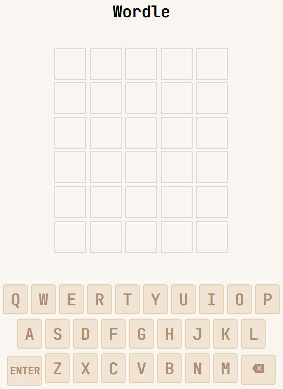

# Wordle Clone


## Description
An interactive Wordle clone featuring core game logic, input validation, and a dynamic UI with color-coded feedback.

## Built With
- `React`
- `JavaScript`
- `CSS`

## Features
- Authentic Wordle gameplay - 6 attempts to guess a 5-letter word
- Real-time color feedback - Green for correct letters/position, yellow for correct letter/wrong position, gray for incorrect letters
- Word validation - Only accepts valid dictionary words from your word list
- Smart letter tracking - Keyboard shows which letters you've used and their status

## Installation & Setup
### Prerequisites
Make sure you have the following installed on your machine:

- Node.js (version 14 or higher) - [Download here](https://nodejs.org/)
- npm (comes with Node.js)
- Git - [Download here](https://git-scm.com/)

### Steps to Run Locally
1. **Clone the repository**
   ```
   git clone https://github.com/fobo-38/wordle-clone.git
   cd wordle-clone
   ```
2. **Install dependencies**
   ```
   npm install
   ```
3. **Create the word list file**</br>
   *Create a file called `wordList.js` in the `src` directory*:
   ```
   touch src/wordList.js
   ```
   *Add your word list to `src/wordList.js`*
4. **Start the development server**
   ```
   npm start
   ```
5. **Open in browser**</br>
   *The app will automatically open in your browser at `http://localhost:3000`*

## Project Structure
```
wordle-clone/
├── public/
│   ├── index.html
│   └── ...
├── src/
│   ├── Board.js          # Main game component
│   ├── wordList.js       # Word dictionary
│   ├── App.js
│   ├── index.js
│   └── App.css           # Game styles
├── package.json
└── README.md
```
## How To Play
1. Click "Start" to begin a new game
2. Type your 5-letter guess using your keyboard or the on-screen buttons
3. Press Enter to submit your guess
4. Use Backspace to delete letters
5. Color feedback:
   - **Green**: Correct letter in correct position
   - **Yellow**: Correct letter in wrong position
   - **Gray**: Letter not in the word
6. You have 6 attempts to guess the word
7. Click "Play Again?" to start a new round

## License
This project is licensed under the [MIT] License - see the `LICENSE.md` file for details
